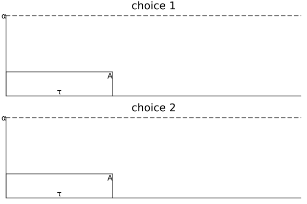

## Basic Example
The function `plot_model` illustrates the evidence accumulation process of a given model. The code block below illustrates the decision dynamics of the racing diffusion model (RDM). 
```@example mode_plot 
using SequentialSamplingModels
using Plots
using Random 
Random.seed!(77)

dist = RDM()
density_kwargs=(;t_range=range(.20, 1.0, length=100),)
plot_model(dist; n_sim=1, density_kwargs, xlims=(0,1.0))
```
On each trial, the starting point $z$ of the evidence accummulation process follows a uniform distribution: 

$z \sim \mathrm{Uniform}(0,A)$

The starting point distribution is represented as the height of the rectangle located at the origin of the plot above. Non-decision time $\tau$, a constant representing the sum of percetual and motor processes, is represented as the width of the rectangle. The dashed horizontal line represents the decision threshold, $\alpha$, which is defined as 

$\alpha = A + k$

where $k$ is the distance between the maximum starting point $A$ and the threshold. The black lines extending from the starting point rectangle represent the noisy accumulation of evidence for each option. The accumulator whose evidence reaches the theshold first determines which option is selected.   

## Add Density Plot

In some cases, it is desirable to include the implied probability density of reaction times. The probability density can be included by setting the keyword `add_density=true`. By default, the probability density is rescaled to have a maximum value equal to the threshold $\alpha = A + k$. Setting the keyword `density_scale=nothing` via `density_kwargs` will prevent rescaling. You may also pass your own desired maximum density value. 

```@example mode_plot 
using SequentialSamplingModels
using Plots
using Random 
Random.seed!(77)

dist = RDM()
density_kwargs=(;t_range=range(.20, 1.0, length=100),)
plot_model(dist; n_sim=1, add_density=true, density_kwargs, xlims=(0,1.0))
```

## Animate 

You can animate the evidence accumulation process with the plotting function `animate`, which works similarly to `plot_model`.  

```julia 
using SequentialSamplingModels
using Plots
using Random 
Random.seed!(77)

dist = RDM()
animate(dist)
```
